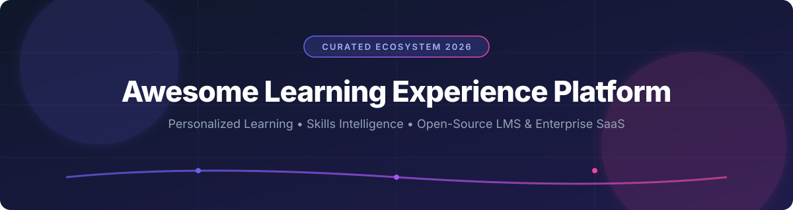

# 🎓 Awesome Learning Experience Platform (LXP) Ecosystem 🚀

  
  

> 💡 A curated directory of top **Learning Experience Platforms (LXP)**, **Skills Intelligence engines**, **Workforce Upskilling tools**, and **Open-Source Learning Management Systems (LMS)**.

---

## 📊 Overview & Market Intelligence

The global **Learning Experience Platform (LXP)** market size is estimated at **$3.5 Billion in 2026** and is projected to expand to over **$10 Billion by 2032** (growing at a CAGR of ~18.5%). 🌐

### 🏛️ Market Structure
The LXP market is **moderately fragmented**:
- 🏢 **Market Leaders & Enterprise Suites**: Enterprise incumbents like Cornerstone OnDemand (acquired EdCast & Clustafunk) and Workday hold significant corporate market share alongside specialized category pioneers like Degreed and 360Learning.
- 🎯 **Specialized Niche & Regional Competitors**: Dozens of specialized vendors target specific segments (e.g., frontline worker upskilling, extended enterprise, collaborative peer authoring), preventing a single "winner-take-all" outcome and maintaining healthy market fragmentation.

---

## 📑 Table of Contents

- [📊 Overview & Market Intelligence](#-overview--market-intelligence)
- [💼 SaaS/Hosted Platforms](#-saashosted-platforms)
- [💻 Open-Source GitHub Projects](#-open-source-github-projects)
- [🤝 Support & Community](#-support--community)
- [📈 Star History](#-star-history)
- [📝 How to Contribute](#-how-to-contribute)
- [⚠️ Disclaimer](#%EF%B8%8F-disclaimer)

---

## 💼 SaaS/Hosted Platforms

The table below summarizes leading commercial Learning Experience Platforms, ranked by company size (valuation / estimated annual revenue). 💵

| Platform | Estimated Revenue / Valuation | Starting Price | Free Tier / Trial Limit | Key Focus & Features |
| :--- | :--- | :--- | :--- | :--- |
| **[Cornerstone Galaxy / EdCast](https://www.cornerstoneondemand.com/)** | **~$1.0B Revenue** | ~$6.00 / user / month (enterprise volume) | 14-day free trial (upon enterprise request/demo setup) | Enterprise knowledge cloud, unified search, microlearning & talent suite integration. |
| **[Docebo](https://www.docebo.com/)** | **~$200M Revenue** (~$1.5B MCap) | ~$25,000 / year (base enterprise tier) | 14-day free trial (up to 30 users, full features) | AI-powered learning platform with strong LMS + LXP capabilities, content discovery, & extended enterprise features. |
| **[Degreed](https://degreed.com/)** | **~$1.4B Valuation** (~$120M Revenue) | ~$12.00 / user / month (min 500 seats) | 14-day free sandbox demo trial (for enterprise talent teams) | Enterprise pioneer in skills intelligence, multi-source content aggregation, & skills benchmarking. |
| **[Go1](https://www.go1.com/)** | **~$2.0B Valuation** (~$100M Revenue) | ~$6.00 / user / month | 7-day free trial access to content library preview | Global learning content aggregator & marketplace powering third-party LXPs and LMSs. |
| **[360Learning](https://360learning.com/)** | **~$50M Revenue** | ~$8.00 / user / month (Team plan) | 30-day free trial (up to 100 users) | Collaborative LXP emphasizing peer-authored course creation, expert workflows, & social learning. |
| **[Valamis](https://www.valamis.com/)** | **~$35M Revenue** | ~$6.00 / user / month | 14-day free trial demo environment | End-to-end digital learning experience platform with deep learning analytics & skills development tracking. |
| **[Continu](https://www.continu.com/)** | **~$15M Revenue** | ~$10.00 / user / month | 14-day enterprise trial | Modern LMS + LXP for employee onboarding, compliance, and continuous training in the flow of work. |
| **[Disprz](https://www.disprz.com/)** | **~$12M Revenue** | ~$4.00 / user / month | 14-day free trial setup | AI-driven skilling & capability-building platform tailored for frontline & corporate workforce upskilling. |
| **[Learn Amp](https://www.learnamp.com/)** | **~$8M Revenue** | ~$5.00 / user / month | 14-day free trial | Combined LXP & talent development platform focusing on employee engagement, pathways, & performance tracking. |
| **[HowNow](https://hownow.com/)** | **~$6M Revenue** | ~$5.00 / user / month | 14-day free trial (full platform access) | Autonomous LXP making knowledge discovery accessible in the flow of work via browser extensions & integrations. |

---

## 💻 Open-Source GitHub Projects

Open-source learning systems provide high extensibility, data ownership, and cost efficiency. Below are top open-source projects sorted by GitHub stars. 🌟

| Repository | GitHub Stars | License | Description & Use Case |
| :--- | :--- | :--- | :--- |
| **[openedx/edx-platform](https://github.com/openedx/edx-platform)** |  | AGPL-3.0 | Large-scale online learning platform powering edX. Highly extensible via XBlocks for university and corporate delivery. |
| **[moodle/moodle](https://github.com/moodle/moodle)** |  | GPL-3.0 | World's most popular open-source LMS. Extensible via plugins for LXP-style content curation, badges, and learning pathways. |
| **[instructure/canvas-lms](https://github.com/instructure/canvas-lms)** |  | AGPL-3.0 | Modern open-source LMS core used widely in higher ed & K-12. Excellent foundation for building modular learning experiences. |
| **[frappe/lms](https://github.com/frappe/lms)** |  | GPL-3.0 | Easy-to-use, modern open-source Learning Management System built on Frappe Framework. Perfect for rapid course creation. |
| **[sakaiproject/sakai](https://github.com/sakaiproject/sakai)** |  | ECL-2.0 | Java-based enterprise learning and collaboration environment created by leading academic institutions. |
| **[overhangio/tutor](https://github.com/overhangio/tutor)** |  | AGPL-3.0 | The official Docker and Kubernetes deployment framework for Open edX, making LXP/LMS deployment simple and fast. |
| **[chamilo/chamilo-lms](https://github.com/chamilo/chamilo-lms)** |  | GPL-3.0 | Lightweight, user-friendly e-learning platform focusing on usability, multi-tenancy, and global accessibility. |
| **[ILIAS-eLearning/ILIAS](https://github.com/ILIAS-eLearning/ILIAS)** |  | GPL-3.0 | Flexible web-based LMS supporting learning objects, assessment tools, and integrated collaboration tools. |
| **[OpenLXP/openlxp-xds-ui-v2](https://github.com/OpenLXP/openlxp-xds-ui-v2)** |  | MIT | Open-source Learning Experience Platform UI component developed for discovery and reporting of learning experiences (US DoD / ADL TLA architecture). |

---

## 🤝 Support & Community

Thank you for exploring this curated list! If you find this repository helpful, please consider showing your support:
- ⭐️ **Star** this repository to help others discover it.
- 🔀 **Fork** and contribute to keep the list up to date.
- 📢 **Share** with colleagues and talent development teams.
- ☕ **Sponsor / Buy me a coffee**: If you'd like to support ongoing maintenance and curation, check out the [Sponsor Dashboard](https://github.com/sponsors/ishandutta2007).

---

## 📈 Star History

---

## 📝 How to Contribute

1. Fork the repository.
2. Add or update entries in `README.md` using the markdown table formats.
3. Ensure description, pricing, star badges, and revenue estimates are accurate and factual.
4. Submit a Pull Request with a brief summary of additions.
5. Check out our main curated list compilation at [Awesome-Awesome-Awesome](https://github.com/ishandutta2007/Awesome-Awesome-Awesome).

---

## ⚠️ Disclaimer

- This repository is a **community-curated list** for informational and educational purposes.
- Valuation, pricing, and revenue numbers are estimates derived from public reports, investor filings, and market intelligence data as of 2026.
- Open-source platforms require infrastructure management, security compliance, and ongoing maintenance.
